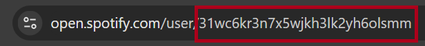

# Discord Music Bot

A Discord bot that allows users to play, pause, resume, skip, and stop songs from their Spotify playlists. It fetches songs from Spotify, retrieves corresponding YouTube links using `yt-dlp`, and streams the audio in a voice channel using `FFmpeg`.

## Features
- Play songs from Spotify playlists
- Pause, resume, skip, and stop songs
- Automatically fetches YouTube links for Spotify songs
- Streams audio using FFmpeg for high-quality playback

## Commands
- `!user [user_id]`: Set your Spotify user ID.
- `!playlist [playlist_name]`: Set the name of the Spotify playlist to play.
- `!play`: Play the songs from the selected playlist.
- `!pause`: Pause the currently playing song.
- `!resume`: Resume the currently paused song.
- `!skip`: Skip the currently playing song.
- `!stop`: Stop the current song and disconnect from the voice channel.

1. Install the required dependencies:
   ```bash
   pip install -r requirements.txt
   ```
2. Make sure `FFmpeg` is installed and added to the system's `PATH`.
3. Add your Spotify API credentials and configure them for `get_spotify.py`.
4. Run the bot:
   ```bash
   python bot.py
   ```

## Finding Your Spotify User ID

To find your Spotify User ID, follow these steps:

1. Go to your [Spotify Profile](https://www.spotify.com).
2. Your user ID is located in your Spotify account settings. 

Here is an image showing where to find it:




## Usage
1. Invite the bot to your server.
2. Join a voice channel in your Discord server.
3. Set your Spotify user ID using `!user [your_spotify_user_id]`.
4. Set the playlist you want to play using `!playlist [playlist_name]`.
5. Use the `!play` command to start playing songs.
6. Control playback with the `!pause`, `!resume`, `!skip`, and `!stop` commands.
